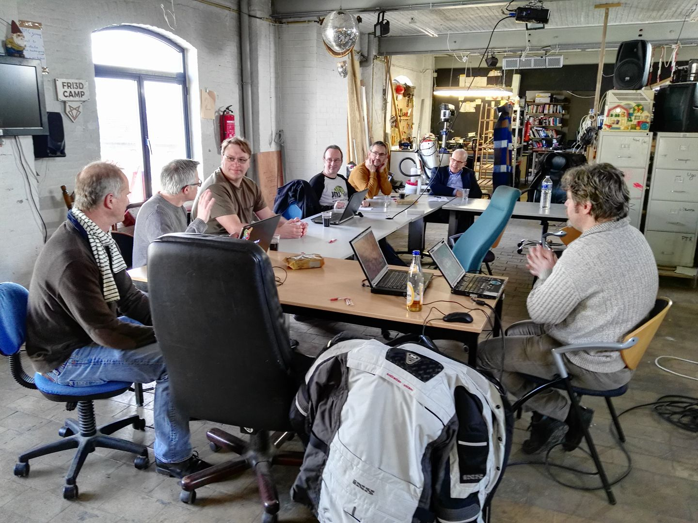

# JUGW - Meeting samedi 11 mars 2017

La présentation générale de la journée se trouve sur https://slides.jugwallonie.be

## Présentation sécurité - hacking

</img>

La présentation de Jurgen est disponible sur Slideshare : https://www.slideshare.net/JurgenGaeremyn/l33t-h4x0rz.

Jurgen revient sur l'état d'esprit de certaines personnes : "*Pourquoi un hacker viendrait-il hacker mon site de l'école de Vilvoorde ?*".  L'idée tellement généralisée et fausse que les hackeurs viennent pirater uniquement des sites "intéressants" alors que les hackeurs sont, d'abord, des robots, des scripts, qui hackent à tout va à la recherche d'un site failible pour, ensuite, en exploiter ses ressources (envoi de spam, vol de réputation SEO, phising, ...).

### Outils

>Eric, membre de la Commission de Protection de la Vie Privée, insiste fortement sur le caractère illégal de l'utilisation de ces outils sur des sites tiers : pour simplifier; on ne peut les utiliser qu'à des fins éducationnelles; sur sa machine locale et jamais sur d'autres serveurs, même ceux de ses clients et même si on est mandaté par ce dernier.

Jurgen nous montre une distribution sur Linux regroupant, prêt à l'emploi, des outils permettant de hacker, de rechercher des informations sur une personne, sur un serveur, ...   Cette distribution est "ready-to-use" et met donc des outils puissants à la portée de tous : scripts kiddies.

Une fois pénétrés, les ordinateurs/serveurs deviennent des zombies.

Suite à cette démo, on comprend vraiment bien qu'il ne faut pas être "un site important" afin d'être hacké : ces outils scannent à tout va, "au petit bonheur la chance" et il suffit d'avoir un nom de domaine (et donc une présence sur internet) pour que ces outils trouvent votre site et tentent d'en mettre à mal la sécurité (=penetration tests).

### WIFI

Jurgen nous parle aussi de la technique sous-jacente au réseau WIFI : toutes les communications WIFI passent par le router qui contacte alors toutes les machines connectées à ce WIFI : "Est-ce toi qui a demandé telle information ?" et chaque machine répond alors "Oui, c'est moi" ou "Non, ce n'est pas moi".  Une machine malhonnête connectée au même WIFI voit donc passer le trafic des autres machines connectées au même WIFI.  Cette machine malhonnête peut donc voir, analyser et enregistrer vos échanges **à votre insu**.

D'où l'extrême importance de crypter ses informations avant même de les transmettre sur un WIFI et là l'utilité du certificat SSL : une connexion https est cryptée au départ de la machine; transmettre ainsi son login et son mot de passe d'administration n'est pas lisible sur le WIFI.

Transmettre un email via WIFI avec un protocole non sécurisé comme POP ou SMTP : votre email, vos identifiants à votre messagerie, ... tout passe en clair !  Comme si vous envoyiez une carte postale.  Idem si vous faites du FTP, que vous vous connectez sur votre Facebook, webmail, ... tout passe en clair sur le WIFI et peut être écouté.

Jurgen recommande l'utilisation de logiciel type VPN qui permettent de crypter toute l'échange entre votre appareil et le réseau.

### Testing tools

**Qualys SSL Labs**, interface internet permettant de vérifier la sécurisation de son site et de son certificat.

*Information : dans l'hypothèse où vous trouvez une faille sur un site web, il est possible de mentionner cet incident auprès du [CERT](https://cert.be).*

### Quelques recommandations :

> La sécurité n'est pas un projet mais un day-to-day task.

* Faites du HTTPS, SFTP, ...,
* Ne vous connectez jamais sur un WIFI public sans avoir activé, avant la connexion, un VPN sécurisé (outils généralement payant),
* Sécurisez votre site et restez systématiquement à jour (installez les dernières version et sans délai aucun si un patch de sécurité à été publié),
* Ne pensez plus jamais que votre site n'intéresse personne, les hackeurs Oui! car votre serveur leur permet de lancer des attaques (zombies),
* Si vous devriez communiquer des données sensibles (un mot de passe p.ex.), un outil de communication crypté peut-être [framabin.org](http://www.framabin.org) (à titre personnel j'utilise zerobin en auto-hébergé càd installé sur mon propre serveur), 
* Et, last but not least, éduquez votre ... PEBCAK (https://fr.wiktionary.org/wiki/PEBCAK),
* ...

Lire aussi le [GUIDE D’HYGIÈNE INFORMATIQUE / Renforcer la sécurité de son système d'information en 42 mesures](https://www.ssi.gouv.fr/uploads/2017/01/guide_hygiene_informatique_anssi.pdf)

## Présentation Joomla 3.7 / Preview Joomla 4

Survol des fonctionnalités par Marc Dechèvre.

A priori, la version 3.7 est prévue, en version stable, fin mars et la version 4 fin de l'année (=ceci est une estimation, cette date est sujette à modification).

Joomla 4 vient avec une toute nouvelle interface d'administration avec un nouveau menu à gauche.

### Joomla 3.7 > sources officielles

* https://www.joomla.org/3 
* https://www.joomla.org/announcements/release-news/5699-the-next-version-of-joomla-is-just-around-the-corner.html 
* https://developer.joomla.org/news/671-joomla-3-7-beta-3-released-for-testing.html 
* https://docs.joomla.org/J3.x:Adding_custom_fields 
* https://docs.joomla.org/J3.x:Adding_custom_fields/What_components_are_supporting_custom_fields
* https://docs.joomla.org/J3.x:Multilingual_Associations 
* https://docs.joomla.org/J3.x:Joomla_3.7_Imagery
* https://github.com/joomla/joomla-cms/pull/13036 Menu manager for Joomla Backend Menu
* https://github.com/joomla/joomla-cms/pull/13537 Gestion multilangue
* https://github.com/joomla/joomla-cms/releases

### Joomla 3.7 > en résumé

* https://developer.joomla.org/news/671-joomla-3-7-beta-3-released-for-testing.html 
* Which bugs have been fixed in Joomla! 3.7?
  * A full list of issues resolved can be found on GitHub.
* What’s new in Joomla! 3.7
  * The big question is, what is new in Joomla! 3.7?
  * Here are some of the new features…
    * Custom Fields - Now you can add data fields (up to 16 different types) to your articles, user records and contacts
    * Multilingual Associations Component - Allows you to easily translate your content from one interface
    * Improved Workflow - Now you can create the category, article, and menu item all in one step (no more jumping between components/views)
    * Improved Router - Get 'clean' URLs (without the ID) to help improve your SEO with one click of a button
    * Admin Menu Manager - Manage the admin menu just like the front-end, create a different 'look' for each user group
    * Do more with TinyMCE - New buttons allow you to easily add menu links, contacts and newsfeeds directly to articles and modules
    * Easier Extension Maintenance - Allowing you to block administrators from accidentally uninstalling needed extension package pieces
    * And many more ...

### Joomla 3.7 > source JoomlaShack

* https://www.joomlashack.com/blog/tutorials/new-urls 
* https://www.joomlashack.com/blog/tutorials/custom-fields (intro)
* https://www.joomlashack.com/blog/tutorials/fields-joomla (details)
* https://www.joomlashack.com/blog/tutorials/multilingual-associations-manager 
* https://www.joomlashack.com/blog/tutorials/joomla-37-release (other features) + The stable release of Joomla 3.7 is due on March 28th, 2017

### Joomla 3.7 > source Brian Teeman

* https://brian.teeman.net/joomla/874-first-looks-joomla-3-7-router 
* https://brian.teeman.net/joomla/875-first-looks-joomla-3-7-its-not-about-the-cash 
* https://brian.teeman.net/joomla/869-coming-soon-or-offline 

### Joomla 3.7 > sources diverses

* http://joomanji.fr/les-nouveautes *Compile 22 nouveautés – en français !!!*
* https://crowdin.com/project/joomla-3-landing-page 
* https://joomlaseo.com/blog/creating-multi-language-websites-got-even-easier-in-joomla-3-7 
* https://www.joomshaper.com/blog/joomla-3-7-to-get-custom-fields-url-router-and-more-features 
* http://sellacious.com/blog/what-to-expect-in-joomla-version-3-7.html 

### Joomla 3.7 > sources vidéos

* https://www.youtube.com/watch?v=NtwDE5Paxd0 vidéo officielle de présentation de J!3.7
* https://www.youtube.com/watch?v=F_Ni15icn1U Custom Fields (JoomlaDay Austria Dec 2016) 38 min. 
* https://www.youtube.com/watch?v=W-yAr8yLKqo J!3.7 New Feature Preview by Brian Teeman - JoomlaDay Israel 2016 Sept 2016

### Joomla 3.8

* https://developer.joomla.org/news/670-production-department-team-lead-meeting.html
  * During the London Super Sprint, discussions regarding the 3.x end of support were started and a working plan was established that 3.8 will be the final release of the series. The department reaffirmed it supports this plan as long as 4.0 releases close to 3.8. Given the current plan for 3.8 and 4.0, the department coordinator states that the two releases should come simultaneously and as such this should not be an issue. Per the current project development strategy, a proper announcement of this must be published six months before 3.8.0 is released. Some discussion on the release timeline started, the department coordinator believes that 3.8 and 4.0 will probably not reach a stable milestone until at least six months after 3.7 is released. The department will work on the required announcement and publish it per the development strategy.
  * Project Roadmap : A weakness the department’s teams has identified is the lack of a cohesive roadmap as it relates to the CMS or Framework’s development. Even with the upcoming 4.0 release, there are several teams and individuals working on several projects or having different visions for what the release should include or how to make the transition. Also, the 4.0 branch now has over 1200 commits to it with several feature changes without any clear documentation on the changes. In general, this area of discussion was broken down into several distinct sections for discussion.

### Joomla 4.0 dev

* Pour télécharger dernière version 4 : 
  * https://developer.joomla.org/nightly-builds.html
  * https://github.com/joomla/joomla-cms/tree/4.0-dev
  * https://github.com/joomla/joomla-cms/milestone/5 
  * https://pcmshaper.com/blog/news/joomla-4-0-or-next-joomla-platform-roadmap
* https://github.com/joomla/joomla-cms/milestone/5 
* https://pcmshaper.com/blog/news/joomla-4-0-or-next-joomla-platform-roadm
* Documentation
  * Le readme sur https://github.com/joomla/joomla-cms/tree/4.0-dev (cf supra)
  * Le manifeste : https://developer.joomla.org/news/658-joomla4-manifesto.html
  * Autre page : https://pcmshaper.com/.../joomla-4-0-or-next-joomla...
  * JWC 2016 (27/11/2016) > The future of Joomla by Marco Dings(en particulier àpd min. 22) en principe, alpha prévue pour J&Beyond en juin 2017 https://www.youtube.com/watch?v=3k2OoGRCXKo&list=PL0Lg2fzcJu1SW0bg1_x0dhV0C8ZfifIWq&index=25&t=6s
  * JoomlaDay UK 2016 (13/02/2016) > Joomla future by Chris Davenport (plutôt sur 3.6) https://www.youtube.com/watch?v=VfLdv6vKiBI

### Media Manager

* pour suivre le Media Manager, c'est ici :  
  https://github.com/joomla-projects/media-manager-improvement  
  (et il doit y avoir une salle sur Glip)
* roadmap (pas sûr qu'elle soit à jour) 
  https://github.com/joomla-projects/media-manager-improvement/wiki 

### Joomla X

* https://github.com/joomla-projects/joomla-pythagoras
* et voir présentation de Marco Dings @ JWC 2016 : https://www.youtube.com/watch?v=3k2OoGRCXKo
